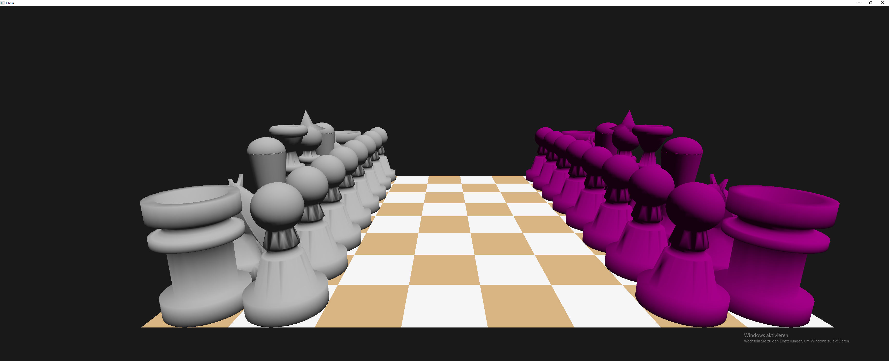

# Chess
Das ist mein Projekt für den CV-Tag an der Uni Koblenz.

Es ist ein Schachspiel, was 3Dimensional gerendert wird.

## Screenshots

## USAGE
- Download this Repository
- add all .jar in the lib subdirs
- execute main.java